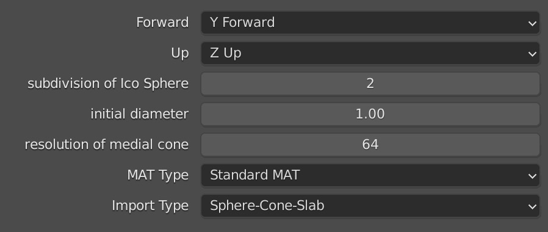
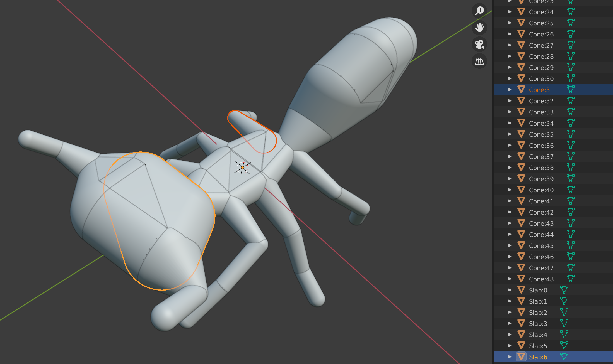

# blender-mat-addon

(Import-Only for now). Pls refer to [link](https://songshibo.github.io/2021/04/12/Medial-Axis-Transform-Mesh-Generation/) for detailed generation process.

And this [post](https://songshibo.github.io/2022/01/04/Updates-for-blender-mat-addon/) for the strategy of detecting degenerated slab.

This addon will generate medial meshes & interpolated MATs from MA files in blender

MA file(Different from [mayAscii](https://download.autodesk.com/us/maya/2011help/index.html?url=./files/Maya_ASCII_file_format.htm,topicNumber=d0e702047)) stores the the information of medial mesh. It can be generated using [Q-MAT](http://cgcad.thss.tsinghua.edu.cn/wangbin/qmat/qmat.html) or [Q-MAT+](https://personal.utdallas.edu/~xguo/GMP2019.pdf).

## Usage

- Download source file in .zip.
- Open blender.
- Edit > Preferences > Addons.
- Click Install button.
- Select .zip.
- Check the checkbox of the MAT add-on to enable it.

---

* Import parameters:

  

  - Subdivision of Ico Sphere: Resolution of medial sphere. The higher the smoother(3 should be enough, 4 may slow down the generation when there are a large number of spheres).
  - initial diameter: default radius of sphere (useless after the generation is optimized, will be removed)
  - resolution of medial cone: 32 should be smooth enough.
  - MAT type:
    - Standard MAT: no extra features for v/e/f in .ma file
    - MAT with features:  Inside Features are marked as Sharp Edge, Outside Features are marked as Seam Edge. (Select one edge in edge select mode, then use Select-Select Similar-Sharpness/Seam to select one type of features).
  - Import Type:
    - Only Medial Mesh: only import medial mesh
    - Sphere-Cone-Slab: generate Sphere Cone Slab separately. (Faster than indivdual primtive)
    - Individual Primtive: generate each Cone and Slab as an independent object. (Very Slow, but for debugging)

## Updates

- Improve the performance of importing high-resolution medial mesh
- Use icosphere instead of UV sphere
- Add subdivision of icosphere/ initial radius of medial sphere
- Using blender-vscode plugin for development.

### Update(2021-10-09)

- Add a new generation mode: each medial primtive will be generated as a single object and named by its index.

In primitive generation mode, each medial primitive will be created as a individual object containing medial sphere/conical surface of medial cone/slab.



---

### Update(2021-12-16)

- Rewrite File View UI
- Greatly improve the speed of medial sphere generation (744 sphere/subdivision 2: 17.07s -> 0.15s)
- Support **Medial Features**
- Add **Only Medial Mesh** import type
- Add **Medial Cone Resolution**

## Results

this addon will import medial axis transform as several objects:

- Medial mesh: named as ```${filename}```.
- Medial sphere: named as its vertex number. eg ```v1```. Its global position and scale are the center & radius of the sphere respectively. All spheres are packed into a group named ```${filename}.SphereGroup```.
- Medial cone: single mesh object named ```${filename}.ConeGroup```.
- Medial slab: single mesh object named ```${filename}.SlabGroup```.


|  |  |  |  |  |
| :-: | :-: | :-: | :-: | :-: |
| medial mesh | medial spheres | medial cones | medial slabs | combined |

## Requirements

- Blender 2.80.0 or older

## MA file structure

> /# number of vertex(medial sphere)/edge(medial cone)/face(medial slab)
>
> vertices edges faces
>
> \# v/e/f indicates the type represented by current line
>
> /# (x,y,z): center of the medial sphere; r: radius
>
> v x y z r
>
> /# two end vertices of the edge
>
> e v1 v2
>
> /# three vertices of a triangle face
>
> f v3 v4 v5
>
> \#  comment lines in MA file should start with #
